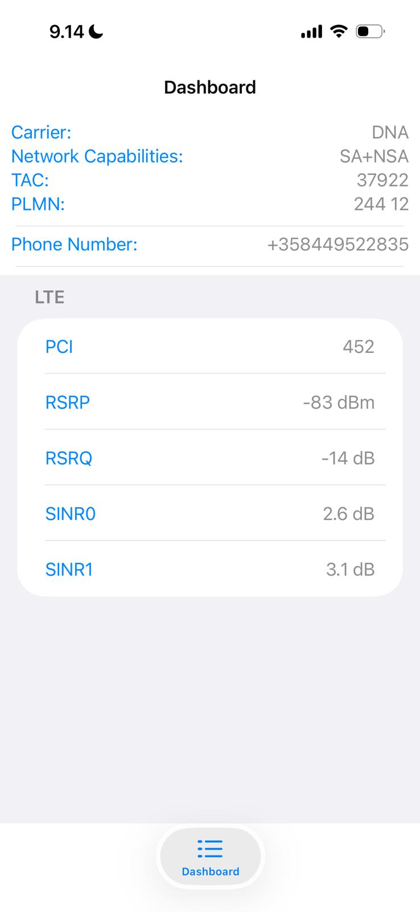

# Wireless and Radiotechnology Course 2026
## Smartphone Cellular Network Service Mode Analysis

**Student:** Talal Khan  
**Course:** Wireless and Radiotechnology  
**Year:** 2026  

## 1. Objective
The objective of this assignment is to explore and analyze cellular network parameters using smartphone service mode. The aim is to understand how signal strength and signal quality change under different conditions and how they affect data speed, network stability, and connectivity reliability.

## 2. Device and Tools Used

- **Smartphone:** iPhone  
- **Network Operator:** DNA Finland  
- **Network Technology:** 4G LTE  
- **Service Mode:** iPhone Field Test Mode  
- **Service Code:** `*3001#12345#*`

Measurements were collected using Apple’s Field Test Mode, which provides real-time LTE radio parameters.

## 3. Parameters Observed

The following cellular network parameters were observed:

- **RSRP (Reference Signal Received Power)** – Signal strength  
- **RSRQ (Reference Signal Received Quality)** – Signal quality  
- **SINR (Signal to Interference plus Noise Ratio)** – Signal quality  
- **PCI (Physical Cell Identity)** – Cell identifier  

## 4. Measurement Scenarios

Measurements were taken under different environmental conditions:

1. Near a window (better signal conditions)
2. Indoors, center of the building (worse signal conditions)

The same LTE cell was used in both measurements.

## 5. Collected Measurement Data

| Location | Network Type | RSRP (dBm) | RSRQ (dB) | SINR (dB) | Cell ID (PCI) |
|--------|-------------|-----------|-----------|-----------|--------------|
| Near window | 4G LTE | -79 | -12 | 8 | 452 |
| Indoors (center) | 4G LTE | -83 | -14 | 3 | 452 |

## Screenshots (Field Test Mode)

### Near window (better signal)

### Indoors (center of building)

Screenshots from iPhone Field Test Mode are included in the repository.

## 6. Analysis

### 6.1 Signal Strength
Near the window, the RSRP value was -79 dBm, which indicates a strong LTE signal. In the center of the building, the RSRP value decreased to -83 dBm due to walls and indoor obstacles.

### 6.2 Signal Quality
Signal quality was better near the window, with higher SINR values. Indoors, SINR dropped to around 3 dB, showing more interference and noise caused by physical obstructions.

### 6.3 Impact on Data Speed and Stability
Higher signal strength and SINR provide better data speed and more stable connectivity. Lower SINR indoors can result in slower speeds and less reliable connections, even though the device remains connected to the same LTE cell.

## 7. Conclusions

This experiment shows that indoor environments significantly affect cellular network performance. Even small changes in location can reduce signal strength and quality. Physical obstacles such as walls increase interference and reduce data performance. Understanding these parameters helps explain real-world mobile network behavior.

## 8. Notes

Carrier frequency and bandwidth were not explicitly displayed in iOS Field Test Mode. This is a known limitation of iOS and does not affect the validity of the measurements.

## 9. References

- 3GPP LTE Specifications  
- Apple iPhone Field Test Mode Documentation  
- Course lecture materials  

